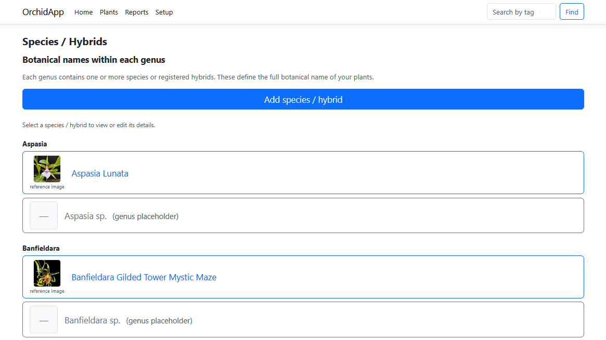
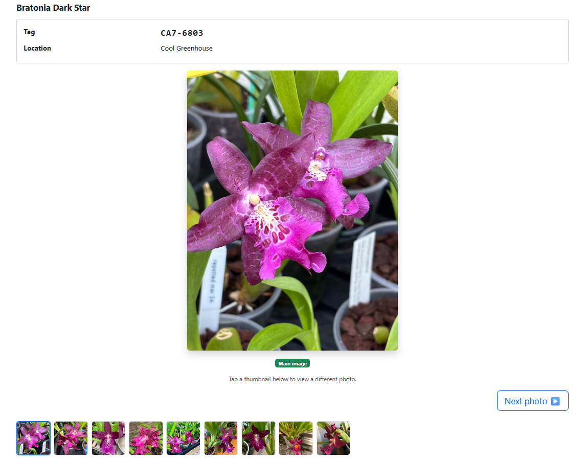

# OrchidApp


- [OrchidApp](#orchidapp)
  - [Current Status](#current-status)
  - [Screenshots](#screenshots)
    - [Mobile: Repot Status](#mobile-repot-status)
    - [Desktop: Plant Details](#desktop-plant-details)
    - [Desktop: Species / Hybrids](#desktop-species--hybrids)
    - [Desktop: Photo Viewer](#desktop-photo-viewer)
  - [Why OrchidApp Exists](#why-orchidapp-exists)
  - [Who This Is For](#who-this-is-for)
  - [Platform Support](#platform-support)
  - [Production Features](#production-features)
  - [What OrchidApp Guarantees](#what-orchidapp-guarantees)
  - [State Model](#state-model)
  - [Architecture](#architecture)
  - [Temporal Model](#temporal-model)
  - [Environment Model](#environment-model)
  - [Database Model](#database-model)
    - [Required MariaDB Configuration](#required-mariadb-configuration)
  - [Migration System](#migration-system)
    - [Critical Rule](#critical-rule)
  - [Schema as Source Code](#schema-as-source-code)
  - [File Storage](#file-storage)
  - [Image Processing](#image-processing)
  - [Deployment Model](#deployment-model)
    - [Fresh Installation](#fresh-installation)
    - [Upgrade](#upgrade)
  - [Backups](#backups)
  - [Disaster Recovery](#disaster-recovery)
  - [Windows upgrades](#windows-upgrades)
  - [Development Workflow](#development-workflow)
  - [Contributing](#contributing)
  - [Security Model](#security-model)
  - [Privacy Model](#privacy-model)
  - [Support](#support)
  - [What This Project Is](#what-this-project-is)
  - [What This Project Is Not](#what-this-project-is-not)
  - [Documentation](#documentation)
  - [Third-Party Licences](#third-party-licences)
  - [Architectural Principle](#architectural-principle)

---

<p align="center">
  
  &nbsp;&nbsp;&nbsp;
  
</p>

<p align="center">
  <em>Mobile-first orchid collection management with structured lifecycle history and full desktop visibility</em>
</p>

OrchidApp is a self-hosted orchid collection manager designed for **correctness, recoverability and long-term ownership of data**.

It records plants, taxonomy, locations, repotting, flowering, observations and photos using a database-backed lifecycle model. The aim is not just to make data entry easy, but to keep the collection history valid over time.

* Database-enforced lifecycle rules
* Structured orchid taxonomy for genera, species and hybrids
* Plant lifecycle history with observations, repotting, flowering and location changes
* Photo upload and plant hero-image support
* Deterministic schema and migration system
* Recoverable state: database plus uploaded photos
* Designed for Raspberry Pi, Windows and home lab use

This is not a loose CRUD app.
This is a collection system with guarantees.

> Invariants live in the database.  
> Behaviour lives in the application.  
> Enforcement lives in automation.

---

## Current Status

OrchidApp is production-ready for personal/self-hosted use.

It currently supports:

* Raspberry Pi deployment using MariaDB and systemd
* Windows installer-led release with bundled application runtime components
* Local database and upload storage
* User-controlled backup configuration
* Recovery from a backup on a new or rebuilt machine
* User documentation for installation, backup and recovery

Windows public upgrades are now installer-led. Application files are installed separately from user data, and the Windows launcher owns layout detection, pre-upgrade backup, legacy data migration and runtime path resolution.

---

## Screenshots

### Mobile: Repot Status


Track plants with clear status, mobile-friendly navigation and quick access to collection records.

---

### Desktop: Plant Details


Manage individual plants with lifecycle history, location tracking, photos and structured event recording.

---

### Desktop: Species / Hybrids



Maintain botanical taxonomy organised by genus, with support for species and hybrids.

---

### Desktop: Photo Viewer



Browse plant photos using a focused viewer with thumbnail navigation and hero-image selection.

---

## Why OrchidApp Exists

Most plant tracking applications optimise for flexibility.

OrchidApp optimises for correctness.

It is designed so that:

* Lifecycle rules cannot be bypassed casually
* Structural plant history remains valid
* Schema changes are repeatable and traceable
* Backups are part of the system, not an afterthought
* Users retain ownership of their own data

This matters for long-lived collections where history, provenance and recoverability are more important than quick ad hoc edits.

---

## Who This Is For

OrchidApp is for:

* Orchid collectors managing growing collections
* Home users who want local ownership of their data
* Hobbyists who want structured plant history rather than notes scattered across spreadsheets or apps
* Home lab users running self-hosted systems
* Developers interested in deterministic database design

It is designed for environments where reliability matters more than flexibility.

---

## Platform Support

| Platform | Status | Notes |
| -------- | ------ | ----- |
| Raspberry Pi / Linux | Production-ready | Primary self-hosted deployment model |
| Windows | Available | Installer-led release; application files are separate from ProgramData user data |
| macOS | Future candidate | Not currently released |

---

## Production Features

* ASP.NET Core Razor Pages (.NET LTS)
* MariaDB database
* EF Core for standard application data changes
* Stored procedures for structural lifecycle changes
* Deterministic migration system with checksum enforcement
* Database schema export and drift detection
* Mobile-first UI design
* Plant photo upload and normalisation
* Local backup support
* Optional cloud-folder copy of latest backup
* Disaster recovery documentation
* Third-party licence notices included with packaged releases

---

## What OrchidApp Guarantees

* The database schema can be rebuilt from committed artefacts
* Existing databases evolve through migrations
* Schema drift cannot occur silently
* Structural lifecycle rules are enforced in the database
* Production state is recoverable from database and upload backups
* Application files are treated as replaceable; user data is not

Correctness is enforced by design, not convention.

---

## State Model

The system has two canonical stateful components:

* MariaDB database (`orchids`)
* Uploaded plant images

Everything else should be treated as rebuildable or replaceable.

This distinction is especially important for packaging, upgrades and disaster recovery.

---

## Architecture

OrchidApp is a layered system:

* **Database layer** — structural integrity and lifecycle invariants
* **Application layer** — user workflows and behavioural orchestration
* **Automation layer** — reproducibility, validation and deployment support
* **Operations layer** — backup, restore and release discipline

No layer may weaken another.

The authoritative architectural contract is defined in:

```text
docs/architecture.md
```

---

## Temporal Model

Time handling, lifecycle boundaries and narrative versus structural behaviour are defined in:

```text
docs/temporal-design.md
```

Temporal behaviour is part of the system contract and must not be reinterpreted casually at the application level.

---

## Environment Model

| Environment | Platform | Configuration |
| ----------- | -------- | ------------- |
| Development | Windows PC | `appsettings.Development.json` |
| Production / Linux | Raspberry Pi | `/etc/orchidapp/orchidapp.env` |
| Packaged Windows app | Windows PC | Local launcher/application settings |

Rules:

* Production never depends on development configuration
* Secrets are never committed to Git
* Runtime configuration is externally supplied or generated locally
* User data must be protected during upgrades

---

## Database Model

MariaDB is the authoritative database engine for OrchidApp.

On Linux, MariaDB is also the authoritative validator for:

* Identifier casing
* Stored procedure parsing
* Collation behaviour
* Deployment-like behaviour

Windows development must not be used as the only validator for database correctness.

### Required MariaDB Configuration

```ini
character-set-server = utf8mb4
collation-server     = utf8mb4_unicode_ci
```

Incorrect character set or collation configuration may cause stored procedures, comparisons or migrations to behave incorrectly.

---

## Migration System

All structural schema changes are implemented through:

```text
database/migrations/
```

Each migration:

* Follows `YYYYMMDDHHMM_Name.sql`
* Is applied exactly once
* Is recorded in `schemaversion`
* Has SHA256 checksum enforcement

The migration system prevents:

* Out-of-order execution
* Duplicate timestamps
* Silent modification of historical migrations
* Schema drift before migration execution

### Critical Rule

A database must be created using **one** of the following mechanisms:

* **Rebuild** for a **fresh** installation
* **Migrations** for an **existing** database

These mechanisms must not be mixed on the same database.

---

## Schema as Source Code

Schema files under:

```text
database/schema/
```

are:

* Generated artefacts
* Deterministic
* Never manually edited
* Validated by GitHub CI checks

They represent the canonical database definition for the project.

---

## File Storage

Uploaded plant images are part of the canonical dataset.

On Raspberry Pi/Linux deployments, uploads are stored under:

```
/opt/orchidapp/uploads
```

On packaged Windows deployments, uploads are stored under:

```
C:\ProgramData\OrchidApp\uploads
```

The Windows launcher passes this path to the web application using:

```
ORCHIDAPP_UPLOAD_ROOT
```

Requirements:

* The upload directory must exist before use
* It must be writable by the application
* It must be included in backups
* It must be preserved across upgrades

---

## Image Processing

Uploaded images are normalised into a canonical format:

* Max dimension: 3072px
* Format: JPEG
* Quality: 90
* Metadata stripped
* Colour profile preserved where practical
* Alpha flattened to white
* Animated images rejected
* Originals not stored

Processing is performed using:

* **libvips / NetVips**

Packaged releases include required third-party licence information.

---

## Deployment Model

### Fresh Installation

A fresh installation uses a clean database rebuild from the committed schema export.

Migrations are not applied to a freshly rebuilt database.

### Upgrade

An upgrade evolves an existing installation by:

* Taking or requiring a backup first
* Applying database migrations where required
* Replacing application files
* Restarting the application
* Preserving user data and uploads

Public Windows upgrades are installer-led. Users must not upgrade by extracting a new ZIP or package folder over an existing OrchidApp folder.

The full installation and upgrade contract is defined in:

```text
docs/user-guides/linux/installation-upgrade.md
docs/windows-upgrade-contract.md
```

---

## Backups

Backups are part of the system design.

The backup model protects:

* MariaDB database
* Uploaded plant images

Raspberry Pi/Linux deployments support automated encrypted backup using `mysqldump` and rclone.

Packaged Windows releases support local backup creation and an optional cloud-folder copy of the latest backup. The cloud folder can be a folder synchronised by OneDrive, Google Drive, Dropbox or a similar service.

Backups are only meaningful if restore works.

Operational documentation:

```text
docs/user-guides/linux/OrchidApp-MariaDB-Backup-and-Restore-Runbook.md
```

User-facing documentation:

```text
docs/user-guides/linux
docs/user-guides/windows
```

---

## Disaster Recovery

OrchidApp is designed so a user can recover onto a rebuilt or replacement machine if they have a valid backup.

The recovery model is:

1. Install OrchidApp on the new machine
2. Locate the latest valid backup
3. Restore the database and uploaded images
4. Start OrchidApp and verify the collection is present

User-facing recovery instructions live under:

```text
docs/user-guides/linux
docs/user-guides/windows
```

---

## Windows upgrades

Public Windows upgrades are installer-led.

Do not upgrade OrchidApp by extracting a new ZIP or package folder over an existing installation.

The installer owns application files only. User data, including the MariaDB database, uploaded plant photos, backups, launcher settings, migration state and launcher logs, is protected separately.

The implemented Windows application install location is:

```
C:\Program Files\OrchidApp
```

The implemented Windows user-data root is:

```
C:\ProgramData\OrchidApp
```

Important Windows user-data paths are:

```
C:\ProgramData\OrchidApp\data\mariadb
C:\ProgramData\OrchidApp\uploads
C:\ProgramData\OrchidApp\backups
C:\ProgramData\OrchidApp\backups\pre-upgrade
C:\ProgramData\OrchidApp\logs
C:\ProgramData\OrchidApp\launcher-settings.json
C:\ProgramData\OrchidApp\migration-state.json
```

The launcher support log is written to:

```
C:\ProgramData\OrchidApp\logs\launcher.log
```

Older ZIP-era Windows layouts may contain live user data under the extracted application folder. Under the installer-led model, those layouts are treated as migration sources.

Before any legacy-to-ProgramData migration, OrchidApp must create a successful pre-upgrade backup. If the launcher detects an ambiguous or unsafe layout, it stops safely rather than guessing.

After ProgramData is in use, later launches use ProgramData directly.

The Windows upgrade contract is defined in:

```
docs/windows-upgrade-contract.md
```

The Windows installer is currently unsigned, so Windows may show Publisher: Unknown. This is an accepted limitation and does not affect the data-safety model.

---

## Development Workflow

Initial setup:

```powershell
pwsh scripts/setup.ps1
```

---

## Contributing

All contributions must follow the project’s architectural, database and operational rules.

See:

```text
CONTRIBUTING.md
```

---

## Security Model

OrchidApp is designed for trusted local or home-network deployment.

* No built-in multi-user authentication model
* Not designed for direct public internet exposure
* Security should be enforced at the network, device and operating-system level
* Users own and control their local data

---

## Privacy Model

OrchidApp does not require a cloud account and does not collect user data for the application author.

Data is stored locally by the user, except where the user chooses to place backups in a cloud-synchronised folder or remote backup destination.

A user-facing privacy statement is included in the application documentation/about area.

---

## Support

Support details are provided in the application About page and release documentation.

Users should include relevant information when requesting help, such as:

* OrchidApp version
* Operating system
* Whether the issue affects startup, backup, restore, photos or data entry
* Any visible error message
* Windows launcher log, if relevant: `C:\ProgramData\OrchidApp\logs\launcher.log`

---

## What This Project Is

* A strict, reproducible collection management system
* A self-hosted orchid record system
* A reference implementation for deterministic database-backed application design
* Designed for correctness, recoverability and long-term use

## What This Project Is Not

* A rapid prototyping tool
* A cloud-hosted SaaS product
* A system tolerant of undocumented manual database changes
* A public-internet application without additional protection

---

## Documentation

Project documentation is located under:

```text
docs/
```

Start here:

```text
docs/index.md
```

User-facing documents are located under:

```text
docs/user-guides/
```

---

## Third-Party Licences

See:

```text
THIRD_PARTY_NOTICES.md
```

Packaged releases include required third-party notices for bundled or redistributed components.

---

## Architectural Principle

> Invariants live in the database.  
> Behaviour lives in the application.  
> Enforcement lives in automation.

Everything else follows from that.

