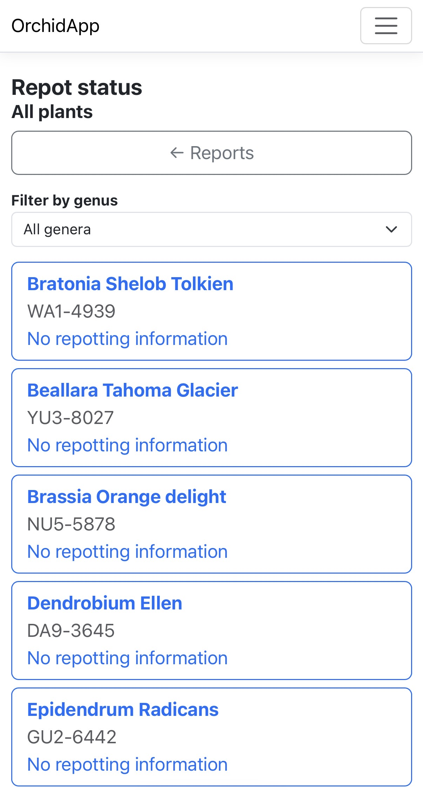
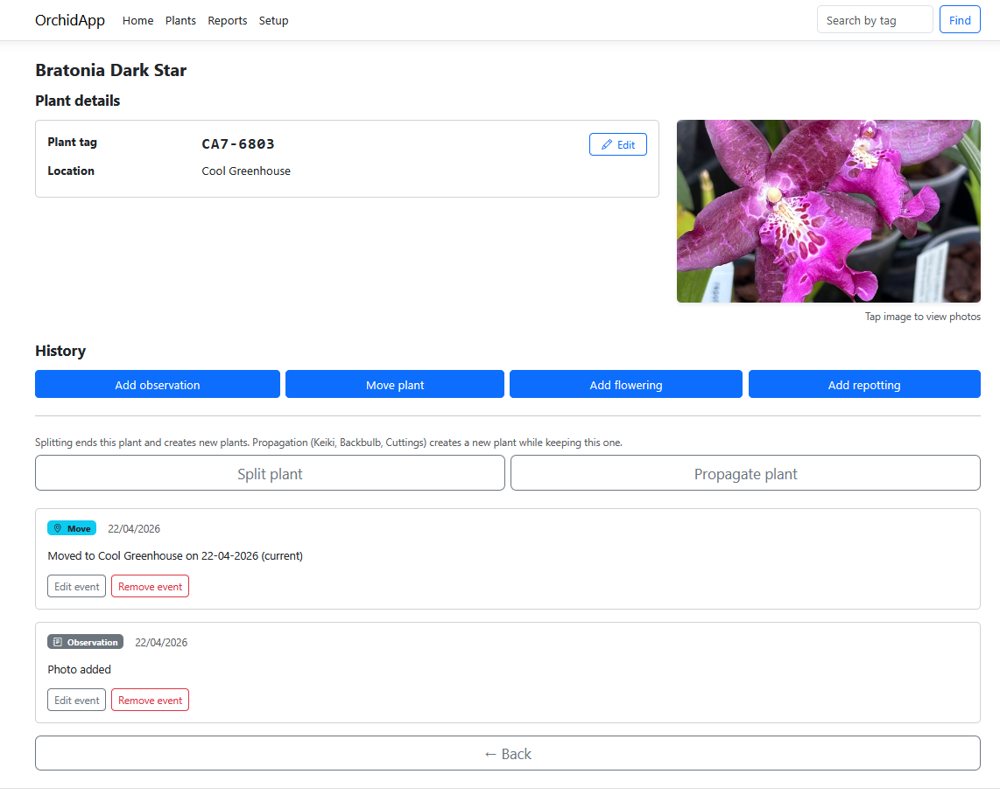

# OrchidApp


<p align="center">
  
  &nbsp;&nbsp;&nbsp;
  
</p>

<p align="center">
  <em>Mobile-first design with structured lifecycle management and full desktop visibility</em>
</p>

A self-hosted orchid collection manager designed for **correctness, not convenience.**

OrchidApp enforces lifecycle integrity at the database level, ensuring that plant history, structure, and state remain valid over time - not just in the UI, but in the data itself.

* Database-enforced lifecycle rules
* Deterministic schema and migration system
* Fully recoverable state (database + uploads)
* Designed for Raspberry Pi and home lab environments

This is not a CRUD app.
This is a system with guarantees.

> Invariants live in the database.
> Behaviour lives in the application.
> Enforcement lives in automation.

---

## Why OrchidApp exists

Most plant tracking applications optimise for flexibility.

OrchidApp optimises for correctness:

* Lifecycle rules cannot be broken
* Schema cannot drift
* Backups are part of the system, not an afterthought

It is designed for long-term, reliable collection management where data integrity matters.

---

## Who this is for

- Orchid collectors managing growing collections  
- Home lab enthusiasts running self-hosted systems  
- Developers interested in deterministic database design  
- Anyone who values correctness and long-term data integrity  

OrchidApp is designed for environments where reliability matters more than flexibility.

---

## Production Status

* ASP.NET Core Razor Pages (.NET LTS)
* EF Core for atomic entities
* Stored procedures for structural entities
* MariaDB (Linux) as the authoritative database environment
* Deterministic migration system with checksum enforcement
* Automated nightly encrypted backups (database + uploads)
* Restore process validated
* Mobile-first UI design
* Deterministic deployment model (systemd + environment file)

OrchidApp is deployed and running on Raspberry Pi (Linux).

---

## What This System Guarantees

* The database schema can be rebuilt from scratch at any commit
* Production state is fully recoverable from backups
* Schema drift cannot occur silently
* Lifecycle invariants cannot be bypassed
* All structural changes are traceable via migrations

Correctness is enforced by design, not convention.

---

## State Model

The system has exactly two stateful components:

* MariaDB database (`orchids`)
* Uploads directory

Everything else is rebuildable from Git.

---

## Architecture

OrchidApp is a layered system:

* **Database layer** - structural integrity and lifecycle invariants
* **Application layer** - behavioural orchestration
* **Automation layer** - reproducibility and enforcement
* **Operations layer** - backup, restore and deployment discipline

No layer may weaken another.

👉 The **authoritative architectural contract** is defined in:

```
docs/architecture.md
```

This document defines all non-negotiable system rules.

---

## Temporal Model

Time handling, lifecycle boundaries, and narrative vs structural behaviour are formally defined in:

```
docs/temporal-design.md
```

Temporal behaviour is part of the system’s core contract and must not be reinterpreted at the application level.

---

## Environment Model

| Environment | Platform     | Configuration                  |
| ----------- | ------------ | ------------------------------ |
| Development | Windows PC   | `appsettings.Development.json` |
| Production  | Raspberry Pi | `/etc/orchidapp/orchidapp.env` |

Rules:

* Production never depends on Development configuration
* Secrets are never committed to Git
* All runtime configuration is externally supplied

---

## Database Model (MariaDB)

MariaDB running on Linux is the authoritative validator for:

* Identifier casing
* Collation behaviour
* Stored procedure parsing

Windows MySQL behaviour must not be relied upon.

### Required Configuration

```ini
character-set-server = utf8mb4
collation-server     = utf8mb4_unicode_ci
```

If misconfigured, stored procedures and comparisons may fail.

---

## Migration System

All structural schema changes are implemented via:

```
database/migrations/
```

Each migration:

* Follows `YYYYMMDDHHMM_Name.sql`
* Is applied exactly once
* Is recorded in `schemaversion`
* Has SHA256 checksum enforcement

The system prevents:

* Out-of-order execution
* Duplicate timestamps
* Silent modification of history
* Schema drift prior to execution

### Critical Rule

A database must be created using **one** of the following:

* **Rebuild** (fresh installation)
* **Migrations** (existing database evolution)

These mechanisms must **never be combined** on the same database.

---

## Schema as Source Code

Schema files under:

```
database/schema/
```

are:

* Generated artefacts
* Deterministic
* Never manually edited
* Validated in CI

They represent the **canonical database definition**.

---

## File Storage

Uploads are stored on the local filesystem:

```
/opt/orchidapp/uploads
```

Requirements:

* Directory must exist before startup
* Must be writable by the application
* Included in backups

Uploads are part of the canonical dataset.

---

## Image Processing

All uploaded images are normalised into a canonical format:

* Max dimension: 3072px
* Format: JPEG
* Quality: 90
* Metadata stripped
* Alpha flattened
* Animated images rejected
* Originals not stored

Processing is performed using:

* **libvips (NetVips)**

---

## Deployment Model

### Fresh Installation

* Rebuild database from schema export
* No migrations applied

### Upgrade

* Apply migrations
* Publish application
* Restart service

👉 The full installation and upgrade contract is defined in:

```
docs/installation-upgrade.md
```

---

## Backups

The system includes an automated backup solution:

* MariaDB snapshot (`mysqldump`)
* Encrypted via rclone
* Uploaded to OneDrive
* 14-day retention (database)
* Encrypted mirror of uploads directory

Backups are only valid if restore succeeds.

👉 Full operational runbook:

```
docs/OrchidApp-MariaDB-Backup-and-Restore-Runbook.md
```

---

## Development Workflow

Initial setup:

```bash
pwsh scripts/setup.ps1
```

Local validation:

```bash
pwsh scripts/ci-local.ps1
```

CI guarantees:

* Schema rebuild from committed artefacts
* Drift detection
* Application build validation

If it fails locally, it will fail in CI.

---

## Contributing

All contributions must follow strict architectural and operational rules.

👉 See:

```
CONTRIBUTING.md
```

---

## Security Model

OrchidApp is designed for deployment within a trusted home network.

* No built-in authentication or authorisation
* Not designed for direct exposure to the public internet
* Security is enforced at the network level (router, firewall)

---

## What This Project Is

* A strict, reproducible, production-grade system
* A reference implementation for deterministic architecture
* Designed for correctness over convenience

## What This Project Is Not

* A rapid prototyping tool
* Tolerant of undocumented manual changes
* Flexible about bypassing enforcement

---

## Architectural Principle

> Invariants live in the database.
> Behaviour lives in the application.
> Enforcement lives in automation.

Everything else follows from that.

---

## Documentation

All system documentation is located under:

docs/

Start here:

docs/index.md

---

## Third Party Licences

See:

```
THIRD_PARTY_NOTICES.md
```
